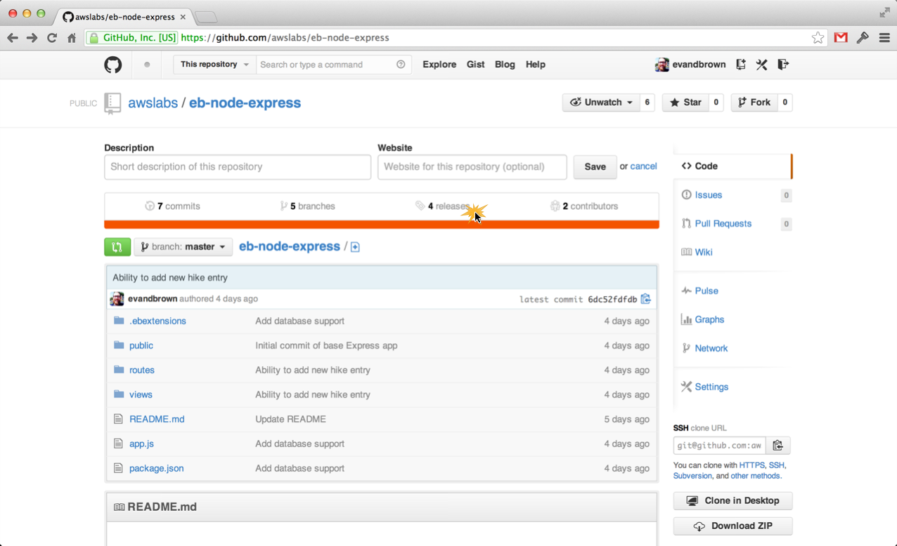
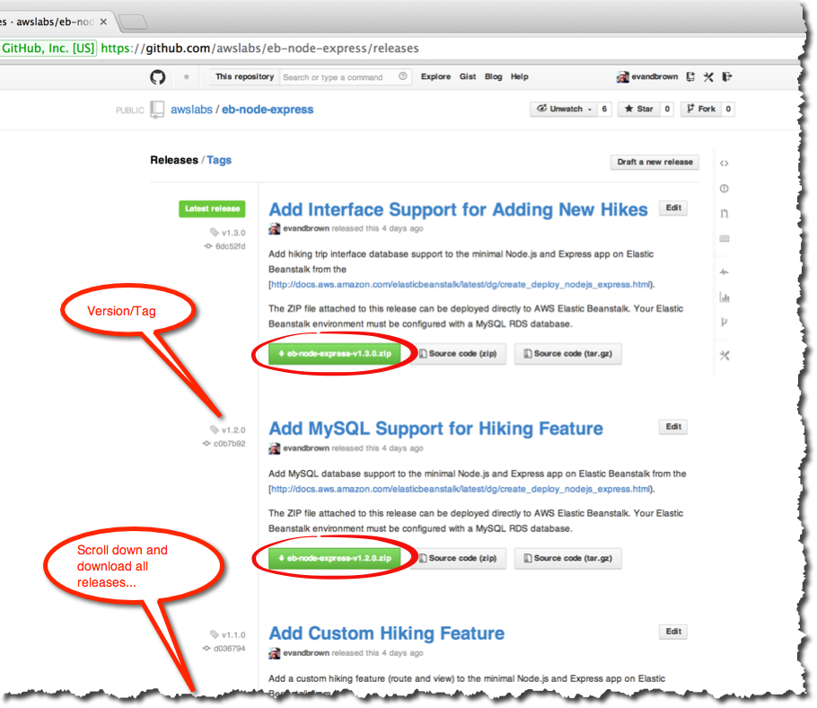

# Choose an Application

Now you'll choose an application to deploy. Each app is in a GitHub repo with multiple releases (a release corresponds to a Git tag). Choose the language you're interested in and download all of the releases for that app to your computer. In the next section you will use Elastic Beanstalk to deploy those releases.

## Languages and Applications

|         | | 
|:-------------:| ------------- |
|       | [http://github.com/awslabs/eb-node-express](http://github.com/awslabs/eb-node-express) |
|     |   [http://github.com/awslabs/eb-php-symfony2](http://github.com/awslabs/eb-php-symfony2) |
|  |    [http://github.com/awslabs/eb-python-flask](http://github.com/awslabs/eb-python-flask) |
|  |    [http://github.com/awslabs/eb-ruby-rails](http://github.com/awslabs/eb-ruby-rails) |

## Step-by-Step

1. Navigate to the **Releases** section of the repository you chose:

	

2. Download **all** of the releases for your application:

	
	
3. **Optional**: If you're up for it, browse the source for each tag:

	
	
---

### [Next Step](deploy-app-version.md)

---
