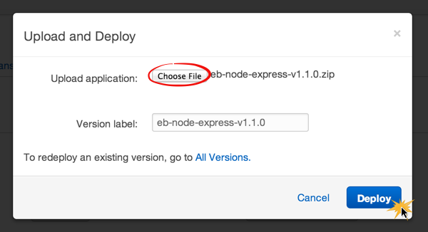
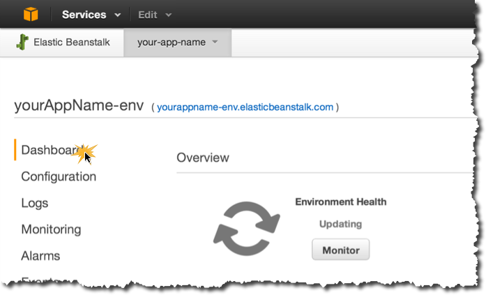

# Deploy a New Application Version

You've got a working Elastic Beanstalk sample app and have downloaded a new app with several versions. Now you're ready to deploy those new app versions to that environment.

## Step-by-Step

### Upload and Deploy a New Application Version

1. Click the Upload and Deploy button on your application's dashboard page:

	

2. Click Choose File, select the first version release (v1.0.0) you downloaded previously, and click Deploy:
	
	
	
3. Your environment status will be Gray while the application is deployed to your environment:

	

4. Open your environment's URL when the status returns to Green

### Use New Version

Refer to the release notes for the app/version that you just deployed for details on what's new with that release and how to use it:

|         |   |
|:-------------:| ------------- 
|  |  [Release Notes](http://github.com/awslabs/eb-node-express/releases) |
|  | [Release Notes](http://github.com/awslabs/eb-python-flask/releases) |

#### Changing Software Configuration

If the version you deployed asks you to change your application's software configuration settings, follow these steps:

1. Click the Configuration link:

	
	
2. Click the Software Configuration gear icon:
	
	
	
3. Change the specified environment setting and click Save:
	
	
	
4. Navigate back to your environment's Dashboard, wait until it's Green, and view it via the URL:
	
	
	
### Repeat

Repeat the above steps to upload and deploy the additional (e.g., v1.1.0, v1.2.0, etc) application versions.

## Congratulations!

You've uploaded and deployed multiple application versions to your Elastic Beanstalk environment!

---

### [Where to Go From Here](where-to-go-from-here.md)

---
