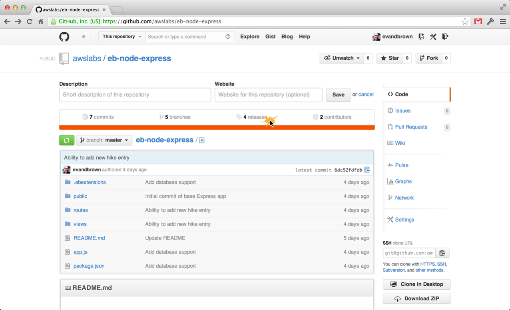
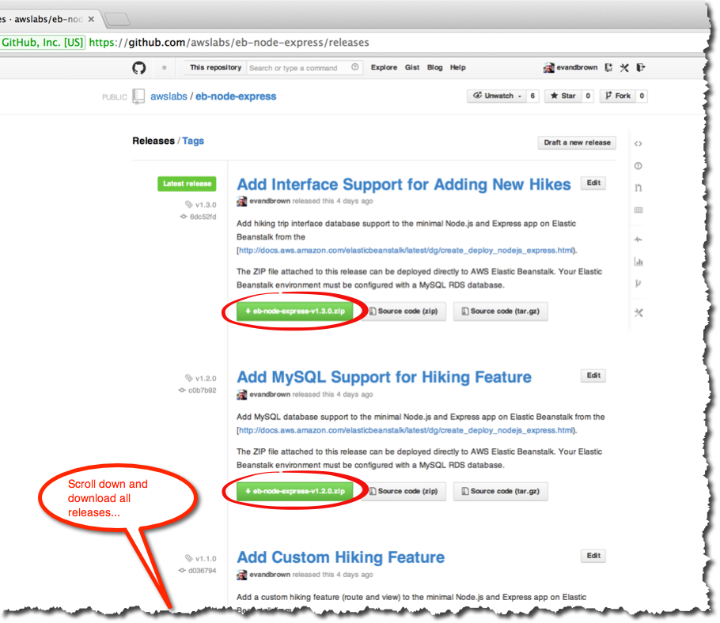
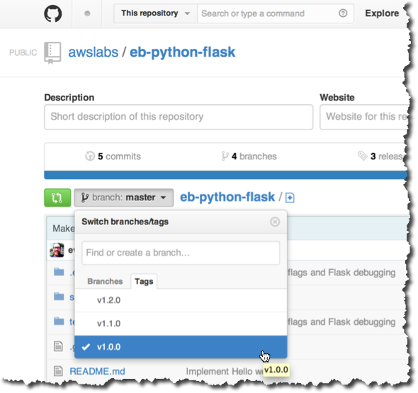

# Get New Application Versions

Now you'll download several versions of a new app from a GitHub repo and prepare to deploy them to your Elastic Beanstalk environment. Each application is hosted in a GitHub repo, and versions are available as Releases.

## Languages and Applications

Choose the language you selected when you chose the Platform for your Elastic Beanstalk application in the [Getting Started](getting-started.md) section:

|         | | 
|:-------------:| ------------- |
|       | [http://github.com/awslabs/eb-node-express](http://github.com/awslabs/eb-node-express) |
|     |   [http://github.com/awslabs/eb-php-cakephp](http://github.com/awslabs/eb-php-cakephp) |
|  |    [http://github.com/awslabs/eb-python-flask](http://github.com/awslabs/eb-python-flask) |
|  |    [http://github.com/awslabs/eb-ruby-rails](http://github.com/awslabs/eb-ruby-rails) |

## Step-by-Step

1. Navigate to the **Releases** section of the repository you chose:

	

2. Download **all** of the releases for your application:

	
	
3. Browse the release notes for each version to get an idea of what's changing between releases 
	
4. **Optional**: If you're up for it, browse the source for each release tag:

	
	
---

### [Next Step](deploy-app-version.md)

---
