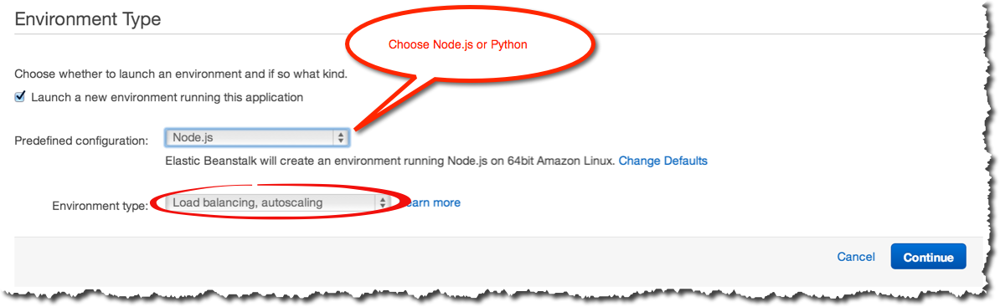
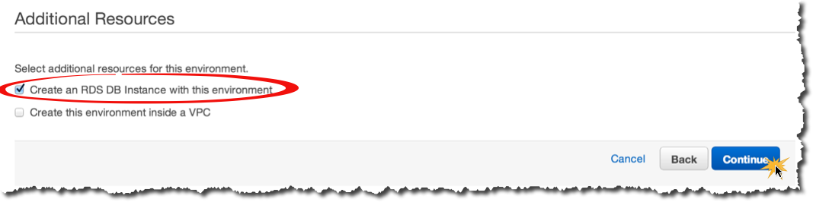
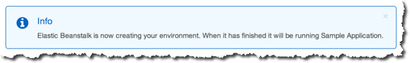

# Getting Started

Let's begin the session by launching a sample app that we'll work with later.

## Step-by-Step

1. Login to the AWS Elastic Beanstalk Management Console at [https://console.aws.amazon.com/elasticbeanstalk/home?region=us-west-2](https://console.aws.amazon.com/elasticbeanstalk/home?region=us-west-2). We'll be using the Oregon (US-West-2) Region.

2. Choose the Oregon Region and create a new application:

	
	
3. Name your application (_Description_ optional):

	

4. Choose **Node.js or Python** for platform, and select a **Load balancing, autoscaling** environment:

	
	
5. Choose the Sample Application:

	
	
6. Give your environment a name and unique URL:
	
	
	
7. Provision an RDS Database for your environment:

	
	
8. Leave config details with defaults:
	
	
	
9. Allocate 5GB for your database and set a username/password:
	
	
	
10. Review details and create:
	
	

## Congratulations!

Your application is now being deployed to an Elastic Beanstalk environment.

## Pause

Now we'll talk about AWS and Elastic Beanstalk before moving on to the next part of the hack session.

---

### [Next Step](view-sample-app.md)

---
