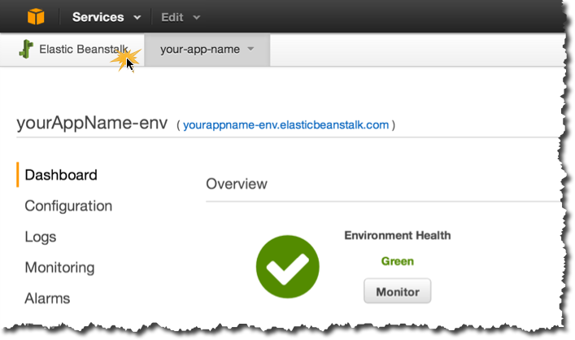
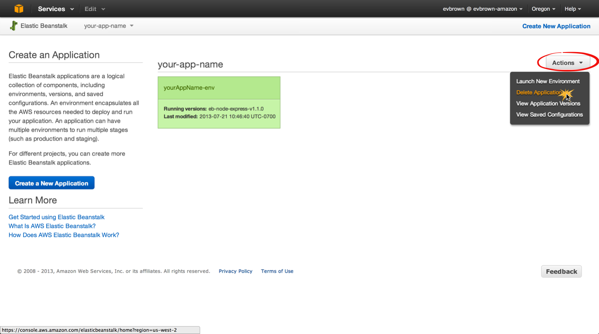

# Delete Your Application
Although the application you deployed falls within the [AWS Free Tier](https://aws.amazon.com/free) for 1 year, you should delete the application before leaving this session.

## Step by Step
1. Go to the Elastic Beanstalk Dashboard:
	
	
	
2. Find your application, click Actions, then Delete Application

	