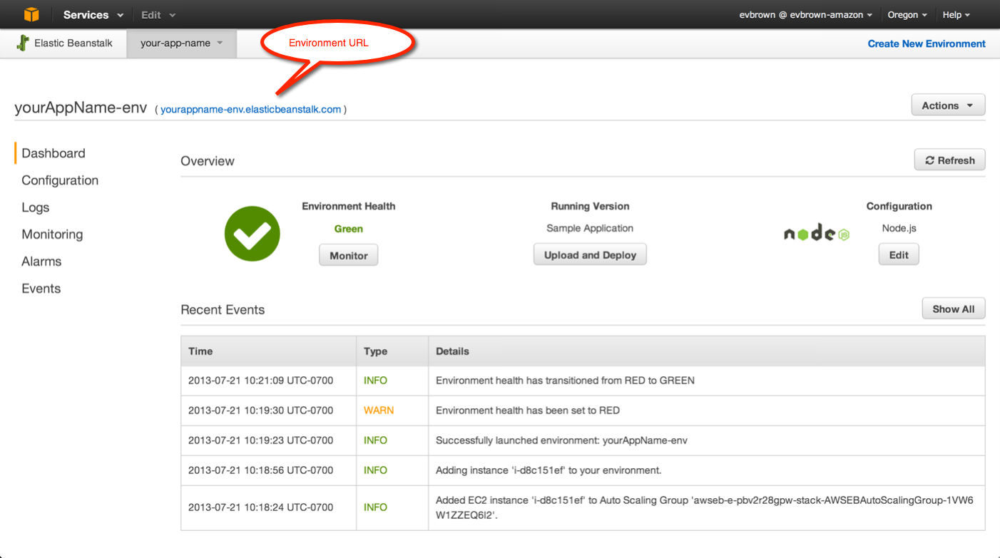
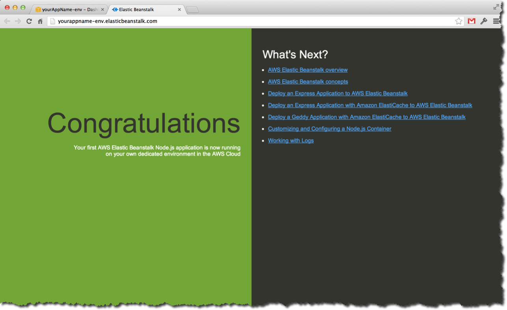

# View Your Sample App

View the Sample Application you deployed to your Elastic Beanstalk environment in the previous section. 

## Step-by-Step

1. Your application is ready when its **Environment Health** is Green:

	

2. Click on your **Environment URL** to open the Sample Application:

	
	
## Congratulations!

You deployed a Sample Application to a new Elastic Beanstalk environment.

In the next section you'll download new application versions from GitHub and deploy them to Elastic Beanstalk.

---

### [Next Step](get-new-app-versions.md)

---
